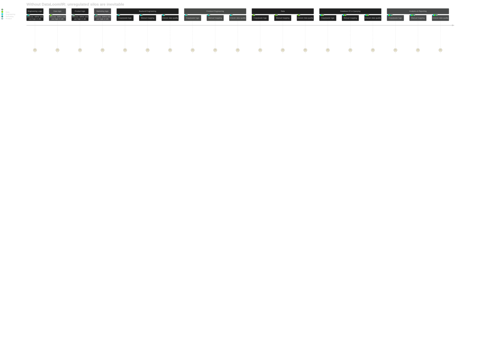

# DataLoom


DataLoom weaves together different data representations and business logic across languages and platforms, creating a unified fabric of consistent data models.

Intermediate Representation (IR) is a common language for representing data models and business logic. It's a core component of the DataLoom.

## Overview

This project is heavily inspired by [Morphir](https://github.com/finos/morphir) - albeit at a much smaller and more localized scale.

Encapsulate business logic in a single place and distribute it across different programming languages, teams and applications. This allows for strong data integrity and consistency across the organization.

It focuses on generating TypeScript modules, Ruby gems, and SQL schemas from protobuf interfaces. The project is designed to provide a comprehensive solution for working with protobuf interfaces in various programming languages and databases (with Snowflake DDL, fivetran, and Tableau support in mind).

## IR Workflow

### Before DataLoom



### After DataLoom


## CLI Workflows

DataLoom provides two main workflows through its CLI:

### Create Protobuf Sample

This workflow allows you to create sample protobuf files from predefined templates including arrays, functions, objects, schemas, enums, maps, oneofs, nested messages, and various Google protobuf types.

### Convert TypeScript to Protobuf

TBD

This workflow converts TypeScript functions into protobuf service definitions, automatically mapping TypeScript types to their protobuf equivalents.

## Prerequisites

- `protoc` (Protocol Buffers compiler)
- `protoc-gen-ts` (TypeScript plugin for `protoc`)
- `ruby` (for Ruby gem generation)
- `node` (see .nvmrc for LTS version)

## Setup

For Ruby gem generation:

```sh
# Install protobuf compiler
brew install protobuf
```

AND

```sh
# Install google-protobuf gem in Gemfile
bundle install
```

OR

```sh
# Install ruby protobuf gem
gem install google-protobuf
```

For TypeScript generation:

```sh
npm install
```


## Generate Usable Outputs from Intermediate Representation (IR)

Run the following script to generate the source code targets from the IR protobuf schema. We use the `protoc` compiler to generate the TypeScript and Ruby code from the protobuf schema. We chose to abstract these bash commands into a Nodee script to make it easier to run and maintain (avoid forcing users to modify local file permissions to make the bash scripts executable, for instance). The node scripts should just work.


### Generate TypeScript Modules

Run the following script to generate TypeScript modules from the protobuf schema:

```sh
npm run generate:ts
```

The generated files will be located in the `generated/ts` directory.


### Generate Ruby Gems

Run the following script to generate Ruby gems from the protobuf schema:

```sh
npm run generate:ruby
```

The generated files will be located in the `generated/ruby` directory.


### Generate Data Warehouse Assets

Run the following script to generate data warehouse-friendly formats from the protobuf schema:

```sh
npm run generate:data
```

This generates:

1. Snowflake DDL files (`*.snowflake.sql`):
   - Tables for storing protobuf message data
   - Flattened views optimized for Tableau
   - Lookup tables for enum values

2. JSON Schema files (`*.schema.json`):
   - Fivetran-compatible schemas
   - Proper type mappings for all fields

The generated files will be located in the `generated/data` directory.


## To Do

- [ ] Provide a way to generate the protobuf schema from the TypeScript and Ruby modules.
- [ ] Provide a means of publishing the generated TypeScript and Ruby modules to a package registry.
- [ ] Provide a means to specific a package registry namespace (e.g., `@my-org/my-package`) for the generated modules.
- [ ] Provide prerequisites and dev environment setup isntructions for Windows and Linux users (only tested on macOS).
- [ ] Target additional languages
  - [ ] Scala
  - [ ] Clojure
  - [ ] Java
  - [ ] Go
  - [ ] Rust
  - [ ] JavaScript?
  - [ ] PHP
  - [ ] C
  - [ ] C++
  - [ ] C#
  - [ ] Python
  - [ ] GraphQL
  - [ ] Zig
  - [ ] Haskell
  - [ ] Bash?
  - [ ] Lua
  - [ ] Standard Schema?
  - [ ] Zod?
  - [ ] JSON Schema
  - [ ] Prisma?
  - [ ] Kotlin
  - [ ] Dart
  - [ ] Swift
  - [ ] Julia
  - [ ] R
  - [ ] Elixir
  - [ ] TB  
