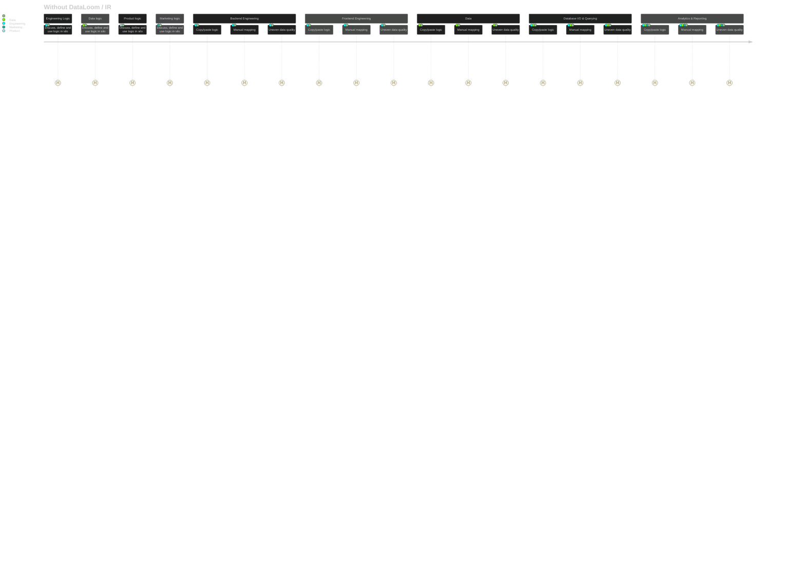
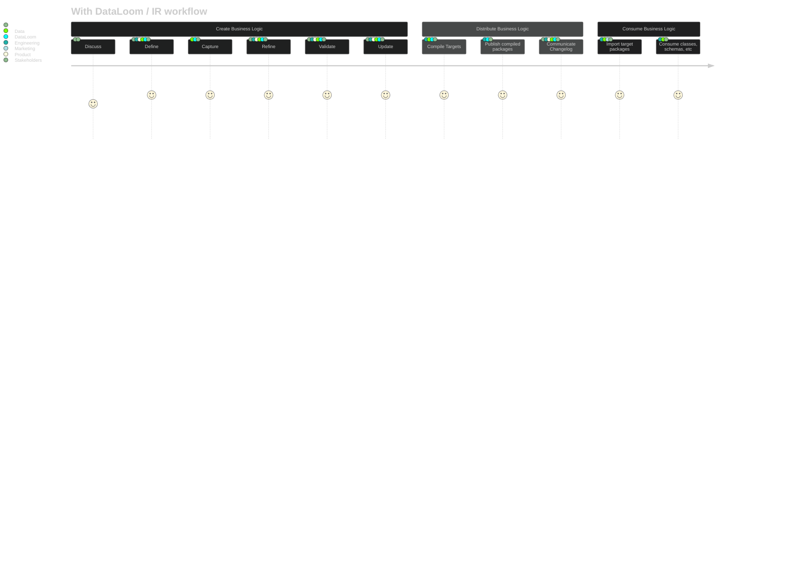

# DataLoom


DataLoom weaves together different data representations and business logic across languages and platforms, creating a unified fabric of consistent data models.

Intermediate Representation (IR) is a common language for representing data models and business logic. It's a core component of the DataLoom.

> Haven't heard of IR before?
>
> Not sure what a protobuf is or how to map your schemas to a protobuf?
>
> We got you covered. Our CLI docs empower you with sample protobuf defintions for common 
> problems and data structures. The CLI will help guide you and give you the tools to 
> start defining your data models in protobuf format. Our sample protobuf definitions are 
> designed to be used as a starting point for your own data models, and they can be 
> easily adapted to fit your specific needs.
>
> We prioritize the shape, structure and hierarchy of the data.
>

## Overview

This project is heavily inspired by [Morphir](https://github.com/finos/morphir) - albeit at a much smaller and more localized scale.

Encapsulate business logic in a single place and distribute it across different programming languages, teams and applications. This allows for strong data integrity and consistency across the organization.

It focuses on generating TypeScript modules, Ruby gems, and SQL schemas from protobuf interfaces. The project is designed to provide a comprehensive solution for working with protobuf interfaces in various programming languages and databases (with Snowflake DDL, fivetran, and Tableau support in mind).

## Prerequisites

- `protoc` (Protocol Buffers compiler)
- `protoc-gen-ts` (TypeScript plugin for `protoc`)
- `ruby` (for Ruby gem generation)
- `node` (see .nvmrc for LTS version)

## Setup

For Ruby gem generation:

```sh
# Install protobuf compiler
brew install protobuf
```

AND

```sh
# Install google-protobuf gem in Gemfile
bundle install
```

OR

```sh
# Install ruby protobuf gem
gem install google-protobuf
```

For TypeScript generation:

```sh
npm install
```

## CLI Workflows

DataLoom tries to empower you to start using `protobufs-as-intermediate-representation` quickly via its CLI:

### Create Protobuf Sample

This workflow allows you to create sample protobuf files from predefined templates. These templates cover common use cases that prioritize the shape, structure and hierarhcy of the data.

https://github.com/user-attachments/assets/61d706ca-d890-4944-a2d7-fd36e29be586


## Generate Usable Outputs from Intermediate Representation (IR)

Run the following script to generate the source code targets from the IR protobuf schema. We use the `protoc` compiler to generate the TypeScript and Ruby code from the protobuf schema. We chose to abstract these bash commands into a Nodee script to make it easier to run and maintain (avoid forcing users to modify local file permissions to make the bash scripts executable, for instance). The node scripts should just work.


To generate new targets, run the following script:

```sh
npm run generate:all
```

### Generate TypeScript Modules

Run the following script to generate TypeScript modules from the protobuf schema:

```sh
npm run generate:ts
```

The generated files will be located in the `generated/ts` directory.


### Generate Ruby Gems

Run the following script to generate Ruby gems from the protobuf schema:

```sh
npm run generate:ruby
```

The generated files will be located in the `generated/ruby` directory.


### Generate Data Warehouse Assets

Run the following script to generate data warehouse-friendly formats from the protobuf schema:

```sh
npm run generate:data
```

This generates:

1. Snowflake DDL files (`*.snowflake.sql`):
   - Tables for storing protobuf message data
   - Flattened views optimized for Tableau
   - Lookup tables for enum values

2. JSON Schema files (`*.schema.json`):
   - Fivetran-compatible schemas
   - Proper type mappings for all fields

The generated files will be located in the `generated/data` directory.

## Quick Example

Using an IR representation of a data model, we can generate a variety of outputs, including TypeScript modules, Ruby gems, and SQL schemas.

For instance, we can transform the following protobuf schema:

```protobuf
syntax = "proto3";

package VisitId;

message VisitIdBusinessLogic {
  string name = 1;
  int32 cookieExpiration = 2;
  bool contains_attribution_query_params = 3;
  
  oneof visit_id_source {
    string visit_id = 4;
    string cookie_name = 5;  // If provided, the visit_id will be parsed from this cookie
  }
  map<string, string> attribution_params = 6;
}

message AttributionParams {
  map<string, string> params = 1;
}

// These are the valid keys for attribution_params
message AttributionParamKeys {
  string url_params = 1;
  string utm_source = 2;
  string utm_medium = 3;
  string utm_campaign = 4;
  string utm_term = 5;
  string utm_content = 6;
  string gclid = 7;
  string fbclid = 8;
  string msclkid = 9;
  string dclid = 10;
  string ad_id = 11;
  string ad_name = 12;
  string ad_group_id = 13;
  string ad_group_name = 14;
  string gtm_id = 15;
  string gtm_event = 16;
  string gtm_trigger = 17;
  string gtm_variable = 18;
  string gtm_data_layer = 19;
  string gtm_container = 20;
  string gtm_account = 21;
  string gtm_workspace = 22;
  string gtm_version = 23;
  string gtm_environment = 24;
}

```

Then, we can generate a TypeScript module. When we do this, we get the following TypeScript module:

```ts
export const protobufPackage = "VisitId";

export interface VisitIdBusinessLogic {
  name: string;
  cookieExpiration: number;
  containsAttributionQueryParams: boolean;
  visitId?:
    | string
    | undefined;
  /** If provided, the visit_id will be parsed from this cookie */
  cookieName?: string | undefined;
  attributionParams: { [key: string]: string };
}

export interface VisitIdBusinessLogic_AttributionParamsEntry {
  key: string;
  value: string;
}

export interface AttributionParams {
  params: { [key: string]: string };
}

export interface AttributionParams_ParamsEntry {
  key: string;
  value: string;
}

/** These are the valid keys for attribution_params */
export interface AttributionParamKeys {
  urlParams: string;
  utmSource: string;
  utmMedium: string;
  utmCampaign: string;
  utmTerm: string;
  utmContent: string;
  gclid: string;
  fbclid: string;
  msclkid: string;
  dclid: string;
  adId: string;
  adName: string;
  adGroupId: string;
  adGroupName: string;
  gtmId: string;
  gtmEvent: string;
  gtmTrigger: string;
  gtmVariable: string;
  gtmDataLayer: string;
  gtmContainer: string;
  gtmAccount: string;
  gtmWorkspace: string;
  gtmVersion: string;
  gtmEnvironment: string;
}

function createBaseVisitIdBusinessLogic(): VisitIdBusinessLogic {
  return {
    name: "",
    cookieExpiration: 0,
    containsAttributionQueryParams: false,
    visitId: undefined,
    cookieName: undefined,
    attributionParams: {},
  };
}
```

When can then be used in a TypeScript application as follows:

```typescript
import { VisitIdBusinessLogic, AttributionParamKeys } from './generated/ts/visitIdBusinessLogic';

// Create a type for valid attribution param keys
type AttributionParamKey = keyof AttributionParamKeys;

const visitCookieDetails = VisitIdBusinessLogic.create({
  attributionParams: {
    'utm_source': 'kdjflkdjfsl',  // TypeScript will know these are valid keys
    'utm_medium': 'social'
  }
});

// You can also type your params object
const params: Record<AttributionParamKey, string> = {
  utm_source: 'kdjflkdjfsl',
  gcl_test: 'test'  // TypeScript error: 'gcl_test' is not a valid AttributionParamKey
};

// Access values safely
const sourceValue = visitCookieDetails.attributionParams['utm_source'];
```

By leveraging protobuf -- and its mature codegen ecosystem and cross-language support -- we can generate a variety of outputs, including TypeScript modules, Ruby gems, and SQL schemas (and more!) while focusing on the shape, structure and hierarchy of our data models. 

In addition to modeling data, we can also use protobuf to build complex business logic as well.

Example: TBD


## IR Workflow

### Without a Data Model strategy using Intermediate Representation (IR)



### After DataLoom



## To Do

- [ ] Provide a way to generate the protobuf schema from the TypeScript and Ruby modules.
- [ ] Provide a means of publishing the generated TypeScript and Ruby modules to a package registry.
- [ ] Provide a means to specific a package registry namespace (e.g., `@my-org/my-package`) for the generated modules.
- [ ] Provide prerequisites and dev environment setup isntructions for Windows and Linux users (only tested on macOS).
- [ ] Target additional languages
  - [ ] Scala
  - [ ] Clojure
  - [ ] Java
  - [ ] Go
  - [ ] Rust
  - [ ] JavaScript?
  - [ ] PHP
  - [ ] C
  - [ ] C++
  - [ ] C#
  - [ ] Python
  - [ ] GraphQL
  - [ ] Zig
  - [ ] Haskell
  - [ ] Bash?
  - [ ] Lua
  - [ ] Standard Schema?
  - [ ] Zod?
  - [ ] JSON Schema
  - [ ] Prisma?
  - [ ] Kotlin
  - [ ] Dart
  - [ ] Swift
  - [ ] Julia
  - [ ] R
  - [ ] Elixir
  - [ ] TB  
